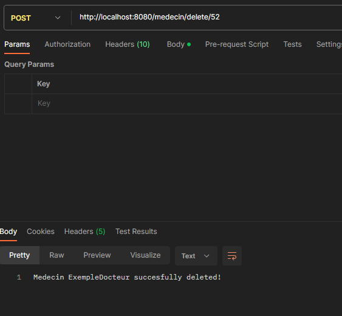

# Compte Rendu de Projet TAA - Un doctolib

## Informations de Base

- **Nom du Projet:** Doctolib
- **Date du Compte Rendu:** 26/11/2023
- **Plateforme de dev:** Windows

## Authors

- [Hamon Guillaume](https://github.com/Gham0n/tpjpa2023)
- [Léo Nolière](https://github.com/LeoNoliere)

## Description du projet

On souhaite développer l'application suivante de type prise de RDV pour tout professionnel. Chaque professionnel de l’application pourra se créer un compte, se loguer, mettre à disposition l’url de récupération des créneaux disponibles, définir la durée nominal d’un RDV et les intitulés possibles d’un RDV.
Un utilisateur souhaitant consulter un professionnel pourra aussi se créer un compte, se loguer et consulter la liste des créneaux disponibles et réserver un créneau.

## Installation

Dans une console, avec git; clonez le projet de la branche voulue:

```
git clone https://github.com/Gham0n/tpjpa2023.git
```

Ensuite ouvrez le projet avec un editeur de code par exemple `VSCode`.
Lancer dans le fichier tpjpa2023; le programme `run-hsqldb-server.bat` (ou `run-hsqldb-server.sh` sous Linux) en double-cliquant dessus.

A présent votre serveur est lancé ! Vous pouvez voir votre base de données en lancant `run-hsqldb.bat` (ou `run-hsqldb.sh`). Et dans le menu _Type_, choisir `HSQL Database Engine Server`, cliquez sur `OK`. Vous pouvez dès à présent voir votre base données et modifier la base de données avec des commandes SQL.

**Exemple:** Voir tous les patients:

```
SELECT * FROM "PUBLIC"."PATIENT"
Execute SQL
```

Maintenant retourner dans votre editeur de code et cliquer sur `Run` depuis le fichier TaaApplication.

Nous pouvons dès à présent executer des actions depuis un navigateur avec l'URL ou depuis une application pour tester les api comme [Postman](<https://fr.wikipedia.org/wiki/Postman_(logiciel)>).

Voici les commandes depuis Postman:

## [GET]

Les requêtes http GET seront pour la récupération des données:

Pour recuperer tous les Patients:

```
http://localhost:8080/patient/
```


Pour recuperer tous les Medecins:

```
http://localhost:8080/medecin/
```


Pour recuperer tous les rendez-vous:

```
http://localhost:8080/rdv/
```


---

Pour recuperer un medecin par un id:

```
http://localhost:8080/medecin/1
```


Marche de la même manière pour les patients et les rendez-vous.

## [POST]

Les requêtes http POST seront pour l'ajout, la modification et la suppression des données:

Pour creer un medecin:

```
http://localhost:8080/medecin/addMedecin
```

```Json
{
  "name": "ExempleDocteur"
}
```


Marche de la même manière pour ajouter un patient.

Pour creer un intitulé:

```
http://localhost:8080/rdv/intitule
```


Pour creer un rdv:

```
http://localhost:8080/rdv/addrdv
```

```Json
{
  "intitule": "3",
  "medecinId": "2",
  "PatientId": "1",
  "timestamp": "2023-09-27T13:31:05.114+00:00 "

}
```


---

Pour supprimer un medecin:

```
http://localhost:8080/medecin/delete/52
```



Marche de la même manière pour supprimer un patient

Pour supprimer un rdv:

```
http://localhost:8080/rdv/delete/52
```


### Organisation du git:

---

Nous avons organisé notre projet sur un git selon la manière suivante:

- TP1_branch : Correspond au TP1
- TP2_branch : Correspond au TP2
- TP3_branch : Correspond au TP3
- TP4_branch : Correspond au TP4

Pour plus de détails

#### TP1 - Mapping Relationnel

Nous avons donc plusieurs entitées:

- Les medecins (Nom)
- Les patients(Nom)
- Les rendez-vous (Date+Heure, l'intitulé du rdv, le medecin, le patient)
- Les intitulés (Urgence, Ordonance, Consultation classique)

> Note: Pour pouvoir creer un rendez-vous, il faut avoir au moins un médecin, un patient et un intitulé.

Nous pouvons voir notre base de données fonctionelle sur `show-hsqldb` et qui tourne sur `run-hsqldb-server`. nous pouvons afficher ou modifier manuellement des données.

- [x] Entités
- [x] DAO
- [x] Base de données SQL

---

#### TP2 - Servlett - API Rest - OpenAI

Nous pouvons donc envoyer et/ou recevoir des données depuis l'URL que nous entrons.

- [x] Servlett
- [x] API Rest
- [x] OpenAPI
  > NOTE: les servlets ont été remplacés par l'API Rest

---

#### TP3 - Spring

La partie Spring a bien été ajoutée

- [x] Injections de dépendances
- [x] Spring AOP
- [x] Spring data / Spring boot

---

#### TP4 - Keycloak

Nous avons réussi à configurer le domaine, à creer les utilisateurs, cependant, nous n'avons pas terminé.

Notre code compile correctement et se lance mais nous avons un soucis, nous arrivons correctement à acceder a l'indexmain, mais lorsque nous voulons aller dans la page reserver aux users ou aux admins, nos pages ne sont pas disponibles.

Nous avons rencontrés des problèmes de configuration sachant que nous étions sous Windows.(Sous Linux avec docker, cela aurait été plus simple.)

- [x] Configurer le domaine
- [x] Creer les utilisateurs
- [ ] Adaptation à notre code

---
